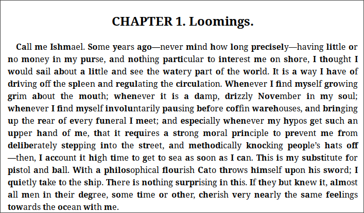

# Bionic Ebooks

The Bionic Ebooks is a command-line tool, written in Rust, that takes an EPUB file and generates a copy of it with bionic font applied.



## Usage

### Install

```bash
cargo install --git https://github.com/ZePedroResende/bionic-ebooks
bionic-ebooks <path-input.epub> <path-output.epub>
```

### Build

```bash
cargo build --release
target/release/bionic-ebooks <path-input.epub> <path-output.epub>
```

## Contributing

PRs accepted.
